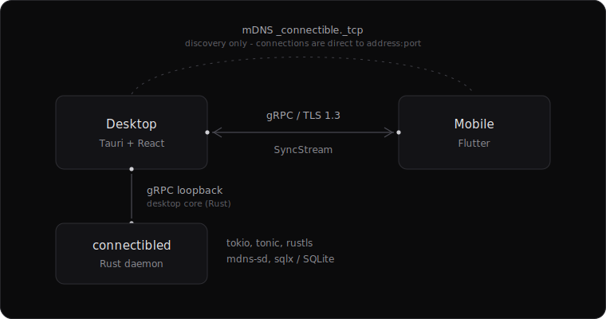

# Connectible

A cross-platform device synchronization tool (a KDE Connect alternative)
built on gRPC over TLS 1.3. Pair your phone and computer on the same
network and sync clipboard, transfer files, mirror notifications, and
drive one device's mouse/keyboard from another -- all end-to-end
encrypted, LAN-only, no cloud.

Monochrome, black-and-grey UI on both desktop and mobile.



## Components

| Path         | Stack                                             | Status |
|--------------|---------------------------------------------------|--------|
| `daemon/`    | Rust, tokio, tonic (gRPC/HTTP2), rustls (TLS 1.3), mdns-sd, sqlx/SQLite, wayland-client | Built + tested (`cargo test --workspace`) |
| `desktop/`   | Tauri v2 + React 18 + TypeScript + Tailwind; a webview-free `core/` crate holds the daemon-client logic | Built + tested (`cargo test`, `npm test`) |
| `mobile/`    | Flutter + Dart + Provider                         | Built + tested (`flutter test`); needs a Flutter toolchain to build |
| `proto/`     | `connectible.proto` (Protocol Buffers v3)         | Frozen v1 |

All documentation lives under [docs/](docs/): the active task file
[docs/TASKS.md](docs/TASKS.md), [docs/RULES.md](docs/RULES.md),
[docs/ARCHITECTURE.md](docs/ARCHITECTURE.md), design notes and
measurements in [docs/design/](docs/design/), and completed plans /
historical task files in [docs/archive/](docs/archive/) (including
[PLAN.md](docs/archive/PLAN.md) and the Phase 0 gap analysis
[FINDINGS.md](docs/archive/FINDINGS.md)). Contributor/AI onboarding
context (project map, settled decisions, conventions, known traps)
lives in [docs/context/](docs/context/). The wire protocol is
[proto/connectible.proto](proto/connectible.proto). `docs/` doubles as
the GitHub Pages root, so the landing page and everything above are
also published at whatever URL this repo's Pages settings point to.

## Quick start (desktop, one command)

Requires Rust, Node.js, and -- for the desktop window -- system webkit
(`webkit2gtk-4.1` on Linux). See [desktop/README.md](desktop/README.md).

```sh
make setup   # one-time: install frontend deps + check system deps
make dev     # runs the daemon + desktop app together; Ctrl-C stops both
```

`make` (no target) lists everything. Common targets:

| Command        | Does |
|----------------|------|
| `make dev`     | Daemon + desktop app together |
| `make daemon`  | Just the daemon |
| `make test`    | All tests (Rust workspace + frontend + mobile) |
| `make check`   | clippy `-D warnings` + strict `tsc` + `flutter analyze` |
| `make build`   | Release: static daemon binary + frontend bundle |
| `make proto`   | Regenerate gRPC stubs for daemon + mobile from `proto/connectible.proto` (the daemon also regenerates automatically on every `cargo build` via `daemon/build.rs`; this target exists for the checked-in Dart stubs and to catch a proto error early) |

## Building each component

### Daemon (Rust)

```sh
cargo run -p connectibled                 # run (dev)
cargo test --workspace                    # daemon + desktop core tests
cargo clippy --workspace --all-targets -- -D warnings
cargo build --release -p connectibled     # single static-ish binary
```

Needs `protobuf-compiler` (protoc) at build time. The daemon generates a
self-signed TLS cert on first run and stores state under the XDG data
dir (`~/.local/share/connectibled/`).

#### Configuration (environment variables)

All are optional and have sensible defaults:

| Variable | Default | Effect |
|----------|---------|--------|
| `CONNECTIBLE_PORT` | `58231` | TCP port the gRPC server listens on and advertises via mDNS. The desktop UI reads the same variable, so overriding it only needs to be set once. |
| `CONNECTIBLE_DEVICE_NAME` | system hostname | Name shown to peers (in `Identity` and the mDNS TXT records). |
| `CONNECTIBLE_DB_KEY_FILE` | unset | Path to the 32-byte database-encryption key file, bypassing the OS-keyring lookup (created at that path on first use if missing) -- for headless setups. See [docs/design/db-encryption.md](docs/design/db-encryption.md). |
| `YDOTOOL_SOCKET` | `/tmp/.ydotool_socket` | Path to the `ydotoold` socket used for X11 remote-input injection. |
| `RUST_LOG` | `info` | Standard `tracing` env-filter (e.g. `RUST_LOG=connectibled=debug`). |

#### Firewall / network requirements

Connectible is LAN-only and needs two things allowed through any local
firewall:

- **TCP `CONNECTIBLE_PORT`** (default `58231`), inbound -- the gRPC/TLS
  server other paired devices connect to.
- **UDP `5353`** (mDNS/multicast DNS), inbound and outbound -- used for
  `_connectible._tcp.local` discovery. Most desktop firewalls already
  allow this for LAN device discovery in general.

If a device can be paired with but never appears as discoverable (or
vice versa), check these two rules first before anything else.

#### Remote input and clipboard: X11 vs Wayland

The daemon picks a backend at startup based on `$XDG_SESSION_TYPE`/
`$WAYLAND_DISPLAY`, and logs which one it selected. Neither path is
"the real one" -- pick whichever setup section below matches your
session, or read both if you use different compositors on different
machines.

**Native Wayland (Hyprland, Sway, and other wlroots-based compositors)**
-- no extra setup, no root, no udev rules. The daemon talks directly to
your compositor over these Wayland protocols:

| Feature | Protocol |
|---------|----------|
| Clipboard sync | `wlr-data-control-unstable-v1` |
| Remote mouse | `wlr-virtual-pointer-unstable-v1` |
| Remote keyboard | `virtual-keyboard-unstable-v1` |

If your compositor doesn't implement one of these (most non-wlroots
compositors, e.g. GNOME/Mutter, implement none of them), the daemon
falls back to the X11 path below via XWayland if that's running, or
disables the affected capability with a clear log line and an
unadvertised capability flag -- never a crash, and never a silent
XWayland-only fallback pretending to be the real thing.

**X11, or Wayland via XWayland** -- clipboard sync (`x11-clipboard`)
needs no setup. Remote input uses
[`ydotool`](https://github.com/ReimuNotMoe/ydotool), which writes to
`/dev/uinput` and needs the daemon to reach a running `ydotoold`:

1. Install and start `ydotoold` (it creates the socket at
   `$YDOTOOL_SOCKET`, default `/tmp/.ydotool_socket`).
2. Allow access to `/dev/uinput` without root via a udev rule, e.g.
   `/etc/udev/rules.d/80-uinput.rules`:

   ```
   KERNEL=="uinput", GROUP="input", MODE="0660", OPTIONS+="static_node=uinput"
   ```

   Then reload rules (`sudo udevadm control --reload-rules && sudo udevadm trigger`),
   add your user to the `input` group, and re-login.
3. `ydotool`'s absolute-pointer coordinate mapping normally queries the
   X11 root window for screen size; if no X11 connection is reachable
   at all (rare -- a Wayland-only session with XWayland disabled and no
   working Wayland input backend either), set `CONNECTIBLE_SCREEN_WIDTH`
   / `CONNECTIBLE_SCREEN_HEIGHT` so coordinates aren't mis-scaled
   against a guessed default.

#### Running the daemon persistently (systemd user service)

`make dev`/`cargo run` are fine for trying Connectible out, but neither
survives logout or a crash. For a daemon that stays paired and synced
in the background across reboots, install the provided systemd user
unit (no root required):

```sh
make install-service   # builds, installs, and enables it in one step
```

Equivalently, by hand:

```sh
cargo build --release -p connectibled
mkdir -p ~/.local/bin ~/.config/systemd/user
cp target/release/connectibled ~/.local/bin/
cp daemon/packaging/connectibled.service ~/.config/systemd/user/
systemctl --user daemon-reload
systemctl --user enable --now connectibled
```

Logs go to the user journal (`journalctl --user -u connectibled -f`).
To also keep it running after you log out entirely (not just between
logins): `loginctl enable-linger "$USER"`. To stop managing it:
`make uninstall-service` (or `systemctl --user disable --now
connectibled` by hand). Design rationale for this unit (why
user-level, why `Restart=on-failure` and not `always`, etc.) is in
[docs/design/systemd-service.md](docs/design/systemd-service.md).
Release builds attach `connectibled.service` alongside the daemon
binary, so a downloaded release doesn't need a repo checkout just to
get the unit file.

### Desktop (Tauri + React)

```sh
cd desktop
npm install
npm run typecheck && npm test    # no daemon/webview needed
npm run tauri dev                # full app (needs webkit2gtk-4.1)
```

The daemon-client logic lives in `desktop/core` (a Rust crate with no
webview dependency), so it builds and its integration tests run
anywhere the daemon does. See
[desktop/docs/ADR-001-desktop-transport.md](desktop/docs/ADR-001-desktop-transport.md)
for why the UI talks to the daemon from the Tauri Rust core rather than
gRPC-Web.

### Mobile (Flutter)

```sh
cd mobile
flutter create --platforms=android,ios .
flutter pub get
./tool/gen_proto.sh              # needs the Dart protoc plugin
flutter run
```

See [mobile/README.md](mobile/README.md). The generated gRPC stubs are
not committed; regenerate them from the shared proto.

## How pairing works

1. Both devices advertise `_connectible._tcp` via mDNS and discover each
   other.
2. Device A opens a TLS 1.3 connection to B and sends `Pair`.
3. B generates a random 6-digit PIN (valid 30s), shows it locally.
4. A prompts for the PIN; on match, both sides persist the peer (the
   daemon in SQLite, mobile in its own local store) and pin each
   other's certificate fingerprints (TOFU -- see Security below).
5. Subsequent connections are verified against the pinned
   fingerprints; a peer presenting a changed certificate is rejected.

mDNS is discovery only -- the actual connection is always direct to
`address:port`, so both apps also offer a manual "connect by address"
fallback for networks where multicast is blocked, and the desktop app
can show a QR code that the phone scans to pair without typing a PIN.

Full sequence in [docs/ARCHITECTURE.md](docs/ARCHITECTURE.md).

## How file transfer works

There is exactly one transfer path: a dedicated streaming upload
(`PrepareUpload` + `UploadFile`) over the same TLS + pairing layer as
everything else. Interrupted transfers resume from the last byte the
receiver has, and every file is verified against a streaming SHA-256
whole-file hash before it is finalized -- a mismatch discards the
partial file instead of saving it. (An earlier chunked-over-SyncStream
path has been removed entirely; its proto fields are reserved.)

On desktop, received files land in the OS downloads directory by
default (the destination is configurable in the app); on mobile they
arrive in app storage, with a per-file "Save to..." action to copy
them anywhere via the system picker. Transfer history survives
restarts: the daemon persists a `transfer_history` table (capped at
500 records) covering both directions for desktop, and mobile keeps
its own local history (capped at 200).

## Security

- **TLS 1.3 mandatory** for all cross-device traffic, enforced on both
  ends: the daemon builds a TLS-1.3-only rustls config, and the mobile
  app's own gRPC server (it can be the responder too -- pairing is
  bidirectional) sets `SecurityContext.minimumTlsProtocolVersion` to
  TLS 1.3 the same way. TLS 1.2 is rejected on both sides.
- No custom crypto; rustls/ring (daemon) and platform TLS (mobile) +
  standard hashing only.
- PIN comparison is constant-time (both daemon and mobile); 3 wrong
  attempts invalidate the PIN, and repeated `Pair` calls for the same
  device are rate-limited (idempotent while a PIN is already showing,
  throttled for a few seconds after a lockout/expiry) so a peer can't
  keep re-popping the local PIN dialog.
- Security here means "an unauthenticated peer can't read/write your
  data or drive your input without the PIN exchange" -- it is not
  claimed as end-to-end (application-layer) encryption on top of TLS.
- **Certificate identity is verified via Trust-On-First-Use pinning,
  bidirectionally.** The connecting side pins the peer's server
  certificate fingerprint on first pair and rejects a changed one
  thereafter (record-on-first-use); a paired daemon additionally
  requests and pins the connecting side's client certificate the same
  way, so a claimed device_id alone is no longer enough to be treated
  as a paired peer -- see [docs/tofu-trust-store.md](docs/tofu-trust-store.md)
  for the full design (including the one asymmetry: mobile's own
  inbound server can't offer the client-cert half, a `dart:io`
  platform limitation documented there).
- The `cert_fingerprint` device-store column is encrypted at rest with
  AES-256-GCM; the key comes from `CONNECTIBLE_DB_KEY_FILE` if set,
  else the OS keyring (Secret Service), else a `0600` key file under
  the daemon's data dir -- see
  [docs/design/db-encryption.md](docs/design/db-encryption.md).

### Known MVP limitations (documented, not hidden)

- Remote input and clipboard sync work on both X11 (via ydotool /
  x11-clipboard) and native Wayland (via wlr-virtual-pointer/
  virtual-keyboard and wlr-data-control on wlroots compositors like
  Hyprland/Sway); a compositor supporting neither surfaces the gap as
  a missing capability flag rather than a crash or a silent
  XWayland-only fallback.
- Clipboard sync is text-only (image support is planned).
- Notification mirroring is display-only: dismissing a notification on
  one device does not yet dismiss it on the other (dismiss-sync is
  planned).
- LAN-only; no internet relay.

The remaining roadmap ([docs/TASKS.md](docs/TASKS.md) Phases K-N) covers
those two gaps plus an end-user guide and real-device battery
measurement.

## CI/CD

[.github/workflows/ci.yml](.github/workflows/ci.yml) runs on every PR:
Rust fmt + clippy + tests, desktop typecheck + vitest + bundle, the full
Tauri build, and Flutter analyze.
[.github/workflows/release.yml](.github/workflows/release.yml) builds a
static daemon (musl), the Tauri bundle, and the Flutter APK on a `v*`
tag and attaches them to a GitHub Release.

## License

TBD.
